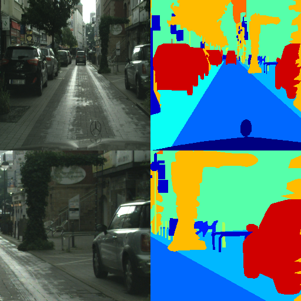
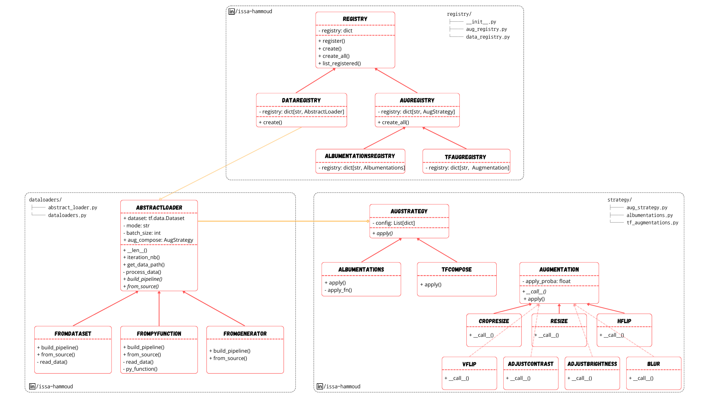

# 🚀 Data Augmentation Benchmark: Optimize TensorFlow Performance

This repository benchmarks TensorFlow dataset creation strategies and [Albumentations](https://albumentations.ai/) augmentations using the [Cityscapes](https://www.cityscapes-dataset.com/) dataset. It features an extensible architecture for vision project datasets (see class diagram below) and serves as supplemental material for the semantic segmentation hands-on of the [Intuitive Deep Learning](https://intuitive-dl.thinkific.com/courses/intuitive-dl) course.

In addition, I wrote a Medium article to explain the code. Check it [here](https://medium.com/@intuitivedl/a-story-of-clean-code-an-ml-use-case-0287cde363fe).

## 🛠 Setup Guide

1. **Install Requirements**

   * Build essential: `sudo apt-get update && sudo apt-get install build-essential`
   * Run: `make`
   * Activate: `source aug_benchmark_env/bin/activate`
   * Clean (only if needed): `make clean`

2. **Get Dataset**

   * Download from [Cityscapes Kaggle](https://kaggle.com/datasets/lqdisme/cityscapes)
   * Place in `data/` directory

3. **Execute Benchmark or Visualize the data**

   * Command: `PYTHONPATH=: python3 src/main.py --config src/configs/config.yaml`

## 📊 Performance Results (Images/sec)

Enable benchmarking by setting `benchmark: True` in your configuration file. This study compares:

**Three TensorFlow Data Creation Strategies**

1. Using TF Operations:
`tf.data.Dataset.from_tensor_slices` + Native TensorFlow I/O

2. TF PyFunction:
`tf.data.Dataset.from_tensor_slices` + Numpy with tf.py_function

3. Generator-based:
`tf.data.Dataset.from_generator` + Python generator

**Augmentation Comparison**

Each method tested with:

✅ TensorFlow-native augmentations

✅ Albumentations augmentations

**Test Parameters**

* Batch Size: 8
* Random Crop: 1024×1024
* Resize: 512×512

| **Data Loading Method**      | **TensorFlow Augmentation** | **Albumentations**       | **Performance Ratio** |
|------------------------------|-----------------------------|--------------------------|-----------------------|
| `from_tensor_slices` | **115** 🏆               | 60                      | 1.9x faster          |
| `tf.py_function`    | 49                         | 46                       | 1.06x faster          |
| `from_generator`      | 16                         | 17                       | 0.94 slower     |

**Benchmark Methodology**

Results represent 5-run averages on Cityscapes 2975 training data. While metrics may vary across hardware, batch sizes, image resolution, and augmentation complexity, our key finding remains consistent: **Native TensorFlow data operations consistently outperform alternatives, including Albumentations**.

*Note that we did not shuffle the data (which will cause slowless to generator-based approach). In addition, the importance of this benchmark depends on the network performance on GPU. If your network is already slow on GPU, it does not matter how fast you dataloader is on CPU.*

## 🔍 Data Visualization & Validation

Visual inspection is crucial for verifying implementation correctness and comparing outputs against Albumentations' transformations. Our implementation includes these core augmentations:

* **Random Crop and Resize**
* **Fixed Resize**
* **Horizontal/Vertical Flip**
* **Gaussian Blur**
* **Random Contrast/Brightness**

Each augmentation's application probability is configurable. To generate side-by-side comparisons (native implementation vs Albumentations):

1. Set `visualize: True` in `config.yaml`
2. Output displays:
   - Top: TensorFlow Augmentations
   - Bottom: Albumentations Processed
3. Press `space` to iterate over the images.
4. Press `Esc` to close the window.

## 🏗️ Core Architecture Overview

This architecture implements three key patterns:

🔷 **Abstraction & Composition**
- Abstract DataLoader for extensible I/O operations.
- Abstract augmentation class.
- Composition of multiple augmentations.

🔷 **Augmentation Strategy Pattern**
- Swappable TF vs Albumentations implementations.

🔷 **Registry & Factory**
- Central catalog of data loaders and augmentation strategies.
- Simplified objects creation.
